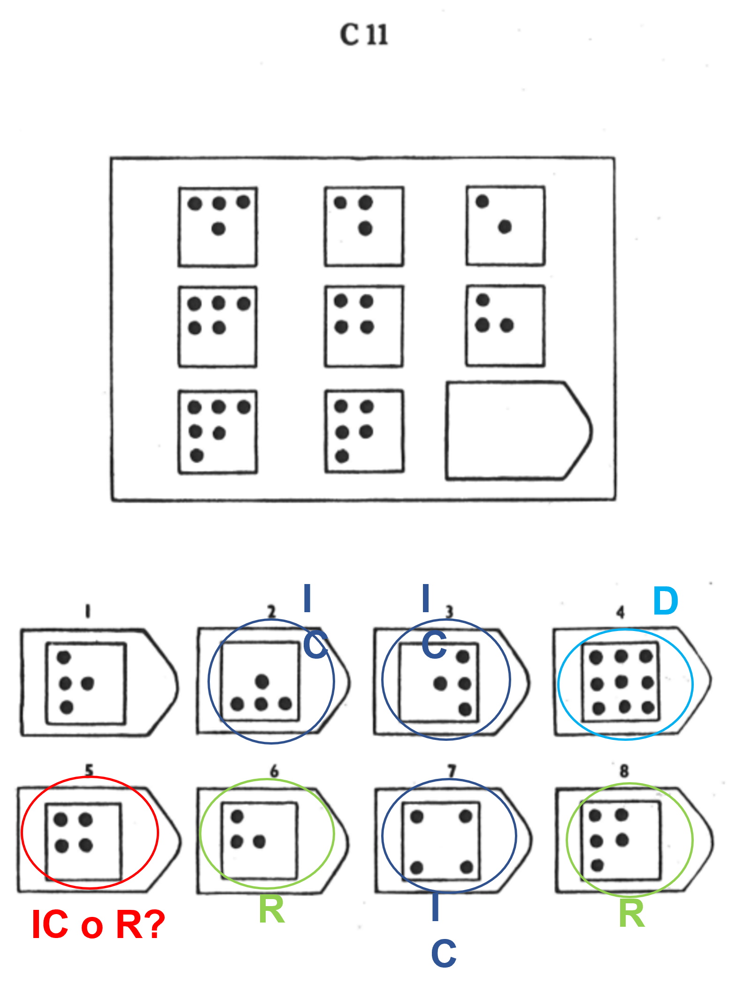

```{r setup, include=FALSE}
knitr::opts_chunk$set(echo = FALSE, 
                      fig.align = "center")
library(DescTools)
source("Class and Methods.R")
source("Class and Methods extension.R")
source("Shapes_list.R")
source("Rules_27102022.R")
library(ggplot2)
## Forme modificate ad Hoc per questi esempi
lilth<-lily()
s.lilth<-s.lily()
for(i in 1:length(lilth$shape)) {
  lilth$size.x[[i]] <-lilth$size.x[[i]]/2
  lilth$size.y[[i]] <-lilth$size.y[[i]]/2
  lilth$pos.y[[i]] <-lilth$pos.y[[i]]/2
  lilth$pos.x[[i]] <-lilth$pos.x[[i]]/2
  
}
d = dice()
d$nv = list(rep(4,4))
d$shade =list(rep("white", 4))
d1 = dice()
d1$shade =list(rep("white", 4))
s.lilth$size.x[[1]] <-s.lilth$size.x[[1]]/2
s.lilth$size.y[[1]] <-s.lilth$size.y[[1]]/2
s.lilth$pos.y[[1]] <-s.lilth$pos.y[[1]]/2
s.lilth$pos.x[[1]] <-s.lilth$pos.x[[1]]/2
for(i in 1:length(lilth$shape)) {
  lilth$size.x[[i]] <-lilth$size.x[[i]]
  lilth$size.y[[i]] <-lilth$size.y[[i]]
  lilth$pos.y[[i]] <-lilth$pos.y[[i]]
  lilth$pos.x[[i]] <-lilth$pos.x[[i]]
  
}
s.lilth$size.x[[1]] <-s.lilth$size.x[[1]]
s.lilth$size.y[[1]] <-s.lilth$size.y[[1]]
s.lilth$pos.y[[1]] <-s.lilth$pos.y[[1]]
s.lilth$pos.x[[1]] <-s.lilth$pos.x[[1]]
xcros<- cross()
xcros$lwd<-xcros$lwd[[1]]+4
xcros$size.x<-xcros$size.x-4
xcros$size.y<-xcros$size.y-4
data = read.csv( "D:/PRIN2020/Raven/Raven-Distrattori/distrattori.csv", 
                header = T, sep = ",")
colnames(data)[ncol(data)] = "note"
for (i in 3:ncol(data)) {
  for (j in 1:nrow(data)) {
    if (data[j,i] == "x") {
      data[j, i] = 1
    }  else {
      data[j, i] = 0
    }
  }
}
data$set = gsub("[0-9]", "", data$Item)
small = data[, c("set", "Item",
                 "Distrattore", "R", "D", "WP", "IC", "R.IC")]
small$var = paste0(small$Item, small$Distrattore)
small = small[, c("set", "Item", "var", "Distrattore", 
                  "R", "D", "WP", "IC", "R.IC")]
long = reshape(small, 
        idvar = "var", 
        direction = "long", 
        varying = list(5:ncol(small)), 
        v.names = "used", 
        times = (colnames(small)[5:ncol(small)]), 
        timevar = "macro")  
sum_dist = data.frame(table(long$macro, long$used, long$set))
colnames(sum_dist) = c("macro", "used", "set", "Freq")
count_dist = aggregate(Freq ~ macro, data = sum_dist[sum_dist$used %in% 1, ], sum) 
colnames(count_dist)[2] = "label"
sum_dist = merge(sum_dist, count_dist, 
                 by = "macro")
```


# Tassonomia dei distrattori 

## Piccola nota

Solo matrici standard e loro distrattori 

Tutto basato sull analisi degli errori che vengono riportate in letteratura


- Set A-B: matrici $2 \times 2$ $\rightarrow$ 5 distrattori, una corretta

- Set C-E: matrici $3 \times 3$ $\rightarrow$  7 distrattori, una corretta


## 

\vspace*{-1cm}
\begin{figure}
\includegraphics[width=\linewidth]{tassonomia.pdf}
\end{figure}

## Non sempre è così facile...

```{r out.width = "35%"}

```


# I distrattori delle SPM

## Frequenza

<!-- ::: columns -->

<!-- :::: column -->


```{r, out.width = "70%"}
ggplot(sum_dist[sum_dist$used %in% 1, ], 
       aes(x = macro, y = label, fill = macro)) + 
  geom_bar(stat = "identity", position = position_dodge()) + theme_bw() + xlab("Macro categoria di distrattori") +
  theme(legend.position = "top", 
        legend.title = element_blank(), 
        legend.text = element_text(size = 28), 
        axis.text = element_text(size = 28),
        axis.title.y = element_blank(), 
        axis.title.x = element_text(size = 28)) + 
  geom_text(aes(label=label), vjust=1.6, color="white",
            position = position_dodge(0.9), size=8)+
  scale_fill_brewer(palette="Paired")
```

<!-- :::: -->

<!-- \pause -->

<!-- :::: column -->


<!-- :::: -->

<!-- ::: -->

## Set e frequenza

```{r, out.width = "70%"}
ggplot(sum_dist[sum_dist$used %in% 1, ], 
       aes(x = set, y = Freq, fill = macro)) + 
  geom_bar(stat = "identity", position = position_dodge()) + theme_bw() + 
  theme(legend.position = "top", 
        legend.title = element_blank(), 
        legend.text = element_text(size = 28), 
        axis.text = element_text(size = 28),
        axis.title.y = element_blank(), 
        axis.title.x = element_text(size = 28))+ 
  geom_text(aes(label=Freq), vjust=.50, color="black",
            position = position_dodge(0.9), size=6.5)+
  scale_fill_brewer(palette="Paired")
```

# Cosa abbiamo pensato 

## Quanti e quali

::: columns

:::: column

\begin{center}
Matrici $2 \times 2$: 
\end{center}

\begin{table}
\centering

\begin{tabular}{p{1cm} p{2cm}}
1 &D\\

2 &WP\\

1 &IC \\

1 & R \\
\end{tabular}

\end{table}


::::

:::: column

\begin{center}
Matrici $3 \times 3$: 
\end{center}

\begin{table}
\centering

\begin{tabular}{p{1cm} p{2cm}}
1 &D\\

3 &WP\\

2 &IC \\

1 & R \\
\end{tabular}

\end{table}

::::

:::


## Un esempio


```{r}
M<-logic_rules(Raven(cof(hline(),square(s.x=3,s.y=3,rot = pi/2, shd="black"),
                         dice(),vline())),"OR")
# risposta corretta
Correct<-M$Sq9
# matrice con blank
M1<-M
M1$Sq9<-hide(M1$Sq9)
# crea i distrattori 
wp_copy = (M[[4]])
#wp_flip
wp_flip = cof(diagline.inv(), square(s.x=3,s.y=3, shd="black"))
#wp_matrix
wp_matrix = cof(d1, 
                square(s.x=3,s.y=3, shd="white"), 
                vline())
# d union
d.union = hide(Correct, c(1, 2,4))
d.union = cof(d.union, Correct, square(s.x=3,s.y=3, shd="black"), X())
# r left 
r.left = M$Sq8
# ic neg 
# IC-neg 
ic.neg = cof(d1, square(s.x=3,s.y=3,rot = pi/2), cross())
# ic flip 
ic.flip = cof(cross.dice(),square(s.x=3,s.y=3, shd="black"), X())
# ic inc 
ic.inc = hide(Correct, 2)
distracters = list(d.union = d.union, 
                   ic.flip = ic.flip, 
                   ic.inc = ic.inc, 
                   wp.flip =wp_flip, 
                   wp.copy = wp_copy, 
                   wp.matrix = wp_matrix, 
                   r.left = r.left, 
                   correct = Correct)
responses = sample(distracters)
```


::: columns

:::: column

\begin{center}
Matrice
\end{center}

```{r out.width="100%"}
draw(M1)
```


::::

:::: column

\begin{center}
Risposte
\end{center}

```{r out.width="100%"}
par(mfcol = c(4,2), mai = c(1, 5, 1, 5))
for (i in 1:length(responses)) {
  draw(responses[[i]], main = names(responses)[i])
}
```


::::


:::

# Osservazioni e dubbi

##

\begin{exampleblock}{Osservazioni}

Non tutti i distrattori possono essere sempre usati 

Dipendenza distrattori/regole/logiche (under investigation right now)


\vspace{5mm}

\end{exampleblock}

\pause

\begin{block}{Dubbi}

? Il numero dei distrattori

? Il tipo di distrattori

\end{block}


## Un'idea

Studio sperimentale *within-subjects*::

1. Le matrici create con le stesse regole ma che si distinguono per un aspetto (e.g., le figure) sono realmente equivalenti?

2. Il numero di distrattori influenza le risposte alla matrice?

Come: 

\begin{table}
\centering

\begin{tabular}{|p{3cm}| p{3cm} | p{3cm} | p{3cm}|}
\hline
\multicolumn{2}{|c|}{Set A} & \multicolumn{2}{c|}{Set B} \\\hline
& & & \\ 
5 distrattori & 7 distrattori   & 5 distrattori & 7 distrattori\\
& & & \\
\hline
\multicolumn{4}{p{12cm}}{Nota: Set A e Set B sono due set di 5/6 matrici generate con le stesse identiche regole ma che differiscono per un grado (e.g., utilizzo di figure differenti)}
\end{tabular}

\end{table}


## Esempio di matrici equivalenti 

::: columns

:::: column

\begin{center}
Set A
\end{center}

```{r out.width="100%"}
M1<-apply(Raven(cof(s.lilth,square(s.x=3,s.y=3,rot = pi/2),cross()),
                "diff_shapes"))
M2<-apply(Raven(cof(square(),circle(),dice()),vrule = "diff_shapes"))      
draw(com(M2,M1))
```


:::: 

:::: column

\begin{center}
Set B
\end{center}

```{r out.width="100%"}
M3<-apply(Raven(cof(dot(),square(s.x=3,s.y=3,rot = pi/2, 
                                 shd="black"),xcros),
                "diff_shapes"))
M4<-apply(Raven(cof(square(),circle(),pentagon()),vrule = "diff_shapes"))        
draw(com(M3,M4))
```

::::

:::